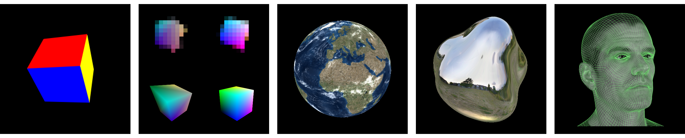

## 미분 가능 렌더링을 활용한 3D 모델 텍스처 개선 프로젝트
이 프로젝트는 NVIDIA의 Nvdiffrast 라이브러리를 기반으로 구현되었습니다. Nvdiffrast는 고성능 미분 가능 렌더링을 위한 PyTorch/TensorFlow 라이브러리로, 래스터화 기반의 미분 가능 렌더링을 위한 기본 연산들을 제공합니다.



**Nvdiffrast: Modular Primitives for High-Performance Differentiable Rendering**<br>
Samuli Laine, Janne Hellsten, Tero Karras, Yeongho Seol, Jaakko Lehtinen, Timo Aila<br>
[http://arxiv.org/abs/2011.03277](http://arxiv.org/abs/2011.03277)

## 환경 설정

이 프로젝트를 실행하기 위해서는 다음 환경이 필요합니다:

- Python 3.7 이상
- PyTorch 1.7.0 이상
- CUDA 11.0 이상
- NVIDIA GPU (Compute Capability 7.0 이상)

설치 방법:
```bash
git clone https://github.com/NVlabs/nvdiffrast
```

자세한 정보는 [nvdiffrast 문서](https://nvlabs.github.io/nvdiffrast)를 참조하시기 바랍니다.

## 프로젝트 개요

이 프로젝트는 2D 이미지로부터 생성된 3D 모델의 텍스처 품질을 개선하기 위한 두 단계의 최적화 파이프라인을 구현합니다.

### 1. 카메라 포즈 최적화 (`samples/torch/pose_optimization/pose_gd.py`)
- 입력: 초기 카메라 포즈, 2D 이미지, 3D 모델 데이터
- 구현:
  - 미분 가능 렌더링을 통한 2D-3D 정합
  - Loss 함수: `L = 0.3·MSE(2D,3D) + 0.7·sil(2D,3D)`
  - MSE: 픽셀별 색상 차이
  - sil: 실루엣 오버랩
- 출력: 최적화된 카메라 포즈

### 2. 텍스처 학습 (`samples/torch/texture_optimization/texture.py`)
- 입력: 최적화된 카메라 포즈, 2D 이미지, 3D 모델 데이터
- 구현:
  - 미분 가능 렌더링을 통한 텍스처 매핑
  - Loss 함수: `L = MSE(2D,3D)`
  - MSE: 픽셀별 색상 차이
- 출력: 개선된 텍스처가 적용된 3D 모델

### 주요 특징
- Nvdiffrast를 활용한 고성능 미분 가능 렌더링
- 실루엣 기반의 정확한 카메라 포즈 추정
- 픽셀 단위의 정밀한 텍스처 매핑

## Licenses

Copyright &copy; 2020&ndash;2024, NVIDIA Corporation. All rights reserved.

This work is made available under the [Nvidia Source Code License](https://github.com/NVlabs/nvdiffrast/blob/main/LICENSE.txt).

For business inquiries, please visit our website and submit the form: [NVIDIA Research Licensing](https://www.nvidia.com/en-us/research/inquiries/)

We do not currently accept outside code contributions in the form of pull requests.

Environment map stored as part of `samples/data/envphong.npz` is derived from a Wave Engine
[sample material](https://github.com/WaveEngine/Samples-2.5/tree/master/Materials/EnvironmentMap/Content/Assets/CubeMap.cubemap)
originally shared under 
[MIT License](https://github.com/WaveEngine/Samples-2.5/blob/master/LICENSE.md).
Mesh and texture stored as part of `samples/data/earth.npz` are derived from
[3D Earth Photorealistic 2K](https://www.turbosquid.com/3d-models/3d-realistic-earth-photorealistic-2k-1279125)
model originally made available under
[TurboSquid 3D Model License](https://blog.turbosquid.com/turbosquid-3d-model-license/#3d-model-license).

## Citation

```
@article{Laine2020diffrast,
  title   = {Modular Primitives for High-Performance Differentiable Rendering},
  author  = {Samuli Laine and Janne Hellsten and Tero Karras and Yeongho Seol and Jaakko Lehtinen and Timo Aila},
  journal = {ACM Transactions on Graphics},
  year    = {2020},
  volume  = {39},
  number  = {6}
}
```
